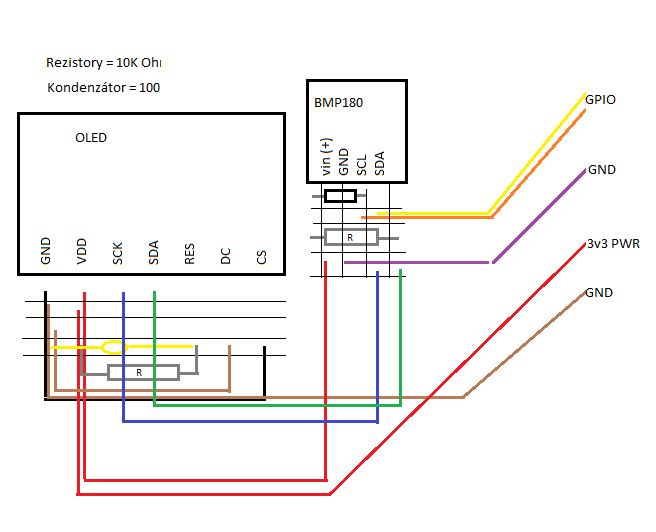

# Zapojování

## 1. Přípravy platforem

### a) Raspberry Pi 3
Díky tomu, že máme nejlepší možné Raspberry Pi B+, tak jeho příprava šla poměrně snadno, pro prvotní nastavení jsme připojili Raspberry k monitoru a k němu ještě klávesnici+myš, systém Raspbian byl již přiložen na SD kartě, tudíž jsme jen provedli nutné aktualizace a nastavili v Raspberry sítě. Následně jsme také přidali programy pro vzdálené ovládání (VNC Viewer) a také pro psaní samostatných programů v námi zvoleném Javascriptu. Obraz celé SD karty jsme si pro jistotu zálohovali, kdyby se něco neočekávaného stalo a my potřebovali čistý systém, kam bychom jen přidali samostatně zálohované kódy. Jako další jsme si vytiskli rozložení pinů na Raspberry pro snadnější práci a zapojování a ve finále jsme vytiskli krabičku pro Raspberry, aby jej bylo možné snadno uložit a přenášet.
### b) Arudino Pro Micro
Arduino jsme si připravili a jako první věc jsme připájely 2 řady pinů, které byly zabaleny u něj, abychom mohli zapojovat senzory a pracovat s ním. Na počítači si připravili Arduino IDE a začali pracovat na realizaci připojení senzorů na nepájivém poli. Samotné arduino jsme zasunuli do nepájivého pole a v řadách odpovídajících pinů začali zapojovat vodiče pro práci se senzory.

## 2. Testování GPIO u Raspberry

### a) b) LED / bzučák
Začali jsme s jednoduchým testováním GPIO portů a jejich ovládáním. Jako první jsme začali s LED diodou, kterou jsme zapojili do nepájivého pole a do odpovídajících zdířek jsme z gpio portu vyvedli vodič ke katodě a k výstupu přidali 330 Ohmový rezistor, od kterého vedli vodič zpátky k Raspberry k pinu GND. To samé jsme zopakovali s bzučákem, u kterého odpadla nutnost přidávat rezistor. Jako další krok jsme pomocí stejného zapojení, akorát se změnou v kódu vyzkoušeli možnosti PWM (pulse width modulation) jak na led diodě, tak bzučáku. Jako poslední
### c) LED RGB
Diodu jsme zapojili tak, že nejdelší nožička (2), bude navazovat na vodič, který povede do GND pinu na Raspberry, ostatní tři nožičky (které zprostředkovávají) zelenou, červenou a modrou, jsme napojili tak, že jsme využili 3x 330 Ohm rezistory, pro každou nožičku zvlášť a pak už jen vedli vodič do Raspberry na GPIO piny. 
### d) port – vstupní režim (push button)
Pro připojení jsme zvolili push button, u kteréhose při stlačení vypsal text v konzoli. Připojení opět bylo velice jednoduché – vyvedení z GND pinu,  do switche a ze switche zpátky vodičem na GPIO pin. 
## 3. Oled, rotační encoder a senzory tlaku a teploty

### a) Oled b) Senzor tlaku BMP180

 
### c) Senzor teploty DALLAS 18B20
Teplotní senzor je připojen dle rozdělení pinů. Vcc (+) se dělí o 3v3 napájecí port na Rpi s rotary encoderem, kousek za napájecím portem je také zapojen rezistor 330 Ohm, který vede k portu na data a vše je to zakončeno vývodem GND, který je zapojen do jednoho z GND portů na Rpi.
### d) 
### e) Rotary encoder
Rotary encoder jsme připojili tak jak jsou udány porty na něm samotném. Všechny piny co z něj vedou končí v Raspberry, až na napájecí port, který je vyveden z nepájivého pole a dělí se o napájení s teplotním senzorem DALLAS. 
CLK a DT určují strany a SW by měl indikovat zmáčknutí.

## 5. Analogové vstupy na Arduinu
Všechny senzory jsou připojeny na nepájivém poli (obr.1), + a - jsou zprostředkovány přes samotné přídavné USB napájení, které je v nepájivém poli a z dalších zdířek následně vede napájení samostatně do LED pásku a zbytek do řady pro napájení ostatních senzorů, napojených v řadě. 
U všech senzorů jsou taky děličky napětí na + větvi. 

### a) Potenciometr 10K 
Senzor jsme připojili na předem určených portech, + a – jsou vyvedeny z řady od přídavného napájení, bez potřeby rezistoru. Prostřední vývod je veden vodičem na řadu, kde je pin u arduina.
### b) Fotorezistor
Senzor je připojen jednou nožičkou v řadě, kudy vede GND z přídavného napájení a vedle je vyveden rezistor, který vede k vodiči, který vede do analogového portu Arduina.
### c) Čidlo teploty
Termistor je připojen stejně jako Fotorezistor. 

## 6. Led + rotary

### a) LED strip
Rgb led pásek má napájení přímo od přídavného napájení v nepájivém poli. Vede zde + i – a pouze poslední – prostřední vodič vede k pinu arduina.
### b) Rotary encoder
Rotační enkoder, je připojen velice jednoduše. VCC A GND jsou opět vyvedeny z řady přídavného napájení a piny pro informace o točení doprava, doleva jsou napojeny na vývody na Arduinu.

### 7. Zabezpečovací prvky
### a) b) Otřešové & polohové čidlo
Čidla jsou zapojeny naprosto stejně, jako všechny ostatní a jejich výstupy připojeny do řady kam směřují nožičky Arduina v nepájivém poli. Je zde také použita dělička napětí
### c) PIR čidlo 
Senzor pohybu má již předem zadané piny, tudíž se opět opakovalo zapojení VCC A GND a zbývající pin byl připojen k vývodu pinu Arduina.

Vodkazy
Potenciometr
https://www.arduino.cc/en/tutorial/potentiometer
Termistor
https://learn.adafruit.com/thermistor/using-a-thermistor
Arduino layout
https://learn.sparkfun.com/tutorials/pro-micro--fio-v3-hookup-guide/hardware-overview-pro-micro

RGB LED 2c)
https://www.instructables.com/id/Using-a-RPi-to-Control-an-RGB-LED/
Tlačítko 2d)
https://www.hackster.io/hardikrathod/push-button-with-raspberry-pi-6b6928
        
